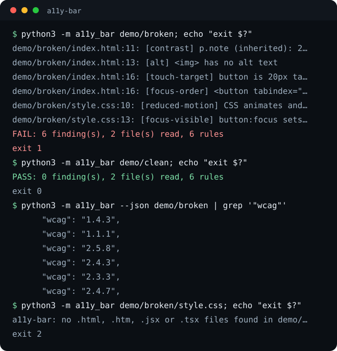

# a11y-bar

a11y-bar reads a web project's CSS and its HTML, JSX and TSX source and reports the WCAG 2.2 failures that can be decided from those files without a browser.

[](https://github.com/eliferres/a11y-bar/actions/workflows/ci.yml)




## What it does

a11y-bar reads a web project's CSS and its HTML, JSX and TSX source and reports the WCAG 2.2 failures that can be decided from those files without a browser: low text contrast, a missing focus ring, undersized buttons, motion with no reduced-motion fallback, positive tabindex, and images with no text alternative. It needs no browser and no network, so it can run on every commit, long before a page is deployed where a browser audit could reach it.

## Install and first run

```bash
pipx install git+https://github.com/eliferres/a11y-bar
a11y-bar path/to/your/site
```

It is not on PyPI; that line installs from this repository. To try it from a clone with no install step:

```bash
git clone https://github.com/eliferres/a11y-bar.git
cd a11y-bar
python3 -m a11y_bar demo/broken
```

```text
demo/broken/index.html:11: [contrast] p.note (inherited): 2.81:1 on 16px text, needs 4.5:1
demo/broken/index.html:13: [alt]  has no alt text
demo/broken/index.html:16: [touch-target] button is 20px tall on a phone, needs 24px
demo/broken/index.html:16: [focus-order] <button tabindex="2"> moves it ahead of the document order
demo/broken/style.css:10: [reduced-motion] CSS animates and no @media (prefers-reduced-motion: reduce) block exists
demo/broken/style.css:13: [focus-visible] button:focus sets outline: none and no :focus or :focus-visible rule draws a ring
FAIL: 6 finding(s), 2 file(s) read, 6 rules
```

`demo/broken` plants one violation per rule, each marked with a comment in its source. `demo/clean` is the same page with every one fixed, and passes. Python 3.9 or newer, standard library only.

## Rules

| Rule | What it catches | WCAG 2.2 |
|---|---|---|
| `contrast` | Text must have a contrast ratio of at least 4.5:1 against its background, or 3:1 for large text (24px, or 18.67px bold) | 1.4.3 Contrast (Minimum), AA |
| `focus-visible` | A stylesheet that removes the focus outline (`outline: none` or `outline: 0`) must draw a replacement ring (outline, box-shadow or border) in a `:focus` or `:focus-visible` rule | 2.4.7 Focus Visible, AA |
| `touch-target` | Buttons, inputs and links styled as buttons (an `<a>` with a class containing `btn` or `pill`) must be at least 24px tall on a phone; a button or input whose size the page never sets is exempt, as WCAG allows for user-agent sizing | 2.5.8 Target Size (Minimum), AA |
| `reduced-motion` | Stylesheets with a transition or animation longer than zero must include a `prefers-reduced-motion` media query (`reduce` to turn motion off, or `no-preference` to turn it on) | 2.3.3 Animation from Interactions, AAA |
| `focus-order` | Elements should not have a `tabindex` greater than zero | 2.4.3 Focus Order, A |
| `alt` | Images must have alternate text (`alt`, which may be empty for a decorative image, a non-empty `aria-label`, `aria-labelledby` or `title`, or a presentation role); image buttons (`<input type="image">`) must have a non-empty name; videos must have an accessible name or be `aria-hidden` | 1.1.1 Non-text Content, A |

Each finding is one line, `file:line: [rule] message`, sorted by file and line, and the last line is the verdict.

## Usage

```text
a11y-bar [PATH ...] [--json] [--min-target PX] [--version]
```

With no path, the current directory is checked.

**What it reads.** Stylesheets are `.css` files plus the `<style>` blocks of `.html` and `.htm` pages. Markup is `.html`, `.htm`, `.jsx` and `.tsx`. Directories are read recursively, skipping `node_modules`, `.git`, `.next`, `coverage` and `__pycache__`.

**Project roots.** Given exactly one directory that contains an `out/` folder (the folder a Next.js static export writes), a11y-bar reads the built CSS and HTML from `out/`, and also reads the markup in `src/`, `app/` and `components/`, so a positive tabindex or a bare `` in a component is caught even when the build is stale. Any other layout is read as given; for a site that builds into `dist/`, pass `a11y-bar dist src`.

**`--min-target PX`** sets the touch-target height. The default is 24, the WCAG 2.5.8 minimum. Pass 44 to hold controls to the 44 by 44 point size Apple's Human Interface Guidelines recommend, which is also the WCAG 2.5.5 (AAA) number.

**`--json`** prints the files read and every finding as `{"rule", "wcag", "file", "line", "message"}`, for a CI annotation step or a dashboard.

| Exit | Meaning |
|---|---|
| 0 | No findings |
| 1 | One or more findings |
| 2 | Usage error: a bad option, a missing path, an unsupported file type, or no markup or no CSS found to check |

The last case is deliberate. A check pointed at the wrong folder reads nothing and finds nothing, and exiting 0 there would report a pass for a page it never saw.

In CI:

```yaml
- name: Accessibility
  run: |
    pipx install git+https://github.com/eliferres/a11y-bar
    a11y-bar .
```

## How it works

**Two viewports.** Contrast and focus are judged at a 1280px desktop: a rule inside a `@media` block that does not hold at 1280px is left out, so a font size meant only for a 359px phone cannot decide the desktop verdict. Touch targets are judged at a 375px phone, because a thumb is what the rule protects. Held to a 44px bar, a button styled 40px tall with `@media (max-width: 599px) { height: 44px }` was once reported as too small because every rule ran at desktop width; the target rule now merges only the rules a 375px phone renders, and counts a `pointer: coarse` or `hover: none` query as a phone at any width.

**Inherited contrast.** Matching a rule's own `color` and `background` found 7 of 462 rules on one real stylesheet, because pages put the background on a wrapper and the colour on the text. A second pass parses each HTML page into an element tree and resolves every text element's colour, background, font size and weight through its ancestors, with a simplified cascade: rules ordered by specificity, the later one winning a tie. Colour inherits; background does not, so the walk stops at the nearest ancestor that paints one, passes over transparent layers, and falls back to the white canvas a browser shows when nothing paints. A background image or gradient stops the walk without a verdict.

**A CSS walk that keeps the at-rules.** A regex over `selector { ... }` loses the `@media` a rule sits in. The parser walks braces and keeps the chain of enclosing at-rules on every rule. A statement at-rule such as `@charset` or `@layer a, b;` ends at its own semicolon; before that was handled, a `@charset` line merged with the selector after it and hid that rule from every check.

**A parser, not a text search.** Markup goes through Python's HTML parser. JSX attribute expressions are masked first, at the same length and with newlines kept, so `onClick={() => a > b}` does not end the tag early and line numbers still match the source. Images inside a `{items.map(...)}` child expression are still read, and a `<style>` tag quoted inside a JavaScript string is not mistaken for CSS.

**A missed finding over a false one.** Anything the tool cannot read is skipped, never guessed at. Text is not judged when a selector it cannot evaluate (a child or sibling combinator, `:not()`, an attribute matcher) or an inline `style` could set its colour, background or font, nor when its size is in `em` or `%`, its colour comes from `color-mix()`, or its background is translucent or a gradient. A `tabIndex` set from a variable is skipped too. Headings are measured at the browser's default size and weight unless the CSS sets them, and the `font` shorthand is read for both. The cost of a gap is a finding not made, never a false one that teaches a team to ignore the report.

## Limitations

a11y-bar complements a browser audit; it does not replace one. Run axe-core or Lighthouse against the rendered pages as well. What a static check cannot decide:

- **The computed cascade.** Only class, id, tag and descendant selectors are matched. Text that a child or sibling combinator, a pseudo-class, an attribute selector or an inline `style` could restyle is skipped rather than measured, so a page written mostly in such selectors gets few contrast checks. `!important` and CSS-in-JS are not read.
- **The runtime DOM.** Classes added by JavaScript, conditionally rendered components and `className` expressions are invisible. The inherited contrast pass runs on HTML pages only; JSX and TSX files are read for the markup rules.
- **Overlapping elements.** Text over an image, a sticky header that covers the focused control (WCAG 2.4.11 Focus Not Obscured), and anything decided by z-order or layout need a rendered page.
- **Non-text contrast.** Only text contrast is measured. The 3:1 contrast of input borders, icons and focus rings (WCAG 1.4.11) is not.
- **Target size is height only.** Width and the spacing exception in 2.5.8 are not evaluated, and a `vw` length is resolved at 1280px even in the phone pass.
- **Presence, not quality.** `focus-visible` asks whether a ring-drawing focus rule exists, not whether it reaches every control whose outline was removed; `reduced-motion` asks whether a `prefers-reduced-motion` query exists, not whether it covers each animation; `alt="image"` passes.
- **Colour names.** Hex, `rgb()`, `rgba()` and `var()` references to them are read; of the named colours only `white` and `black` are.

See [CONTRIBUTING.md](CONTRIBUTING.md) to report a wrong finding or propose a rule. MIT licensed, see [LICENSE](LICENSE).
